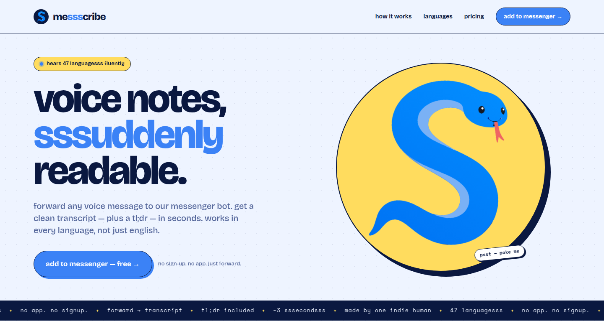

# ssscribe landing pages

**[www.ssscribe.app](https://www.ssscribe.app)** — live



Public-facing marketing pages for the **ssscribe** family — voice-note
transcription bots that live inside messaging apps.

| Sibling | Platform | Theme | Status |
|---|---|---|---|
| messscribe | Messenger | blue | shipped |
| whatsscribe | WhatsApp | green | planned |

Both siblings share one page component themed via CSS variables — dropping in
`whatsscribe` later is a class swap, not a fork. The green token set already
lives in `src/index.css` as `.theme-whatsscribe`; nothing renders it yet.

## Stack

- React 19 + TypeScript
- Vite 6 (SWC)
- Tailwind v4 — for the `@theme` token bridge and preflight, not utilities
- GSAP (the snake mascot's idle motion)

No router — the site is one page and navigation is in-page anchors. No UI library. Layout and visual styling are hand-authored: a small set of
named layout classes in `src/index.css` (`.hero-grid`, `.story-grid`,
`.pricing-receipt-grid`) plus inline `style` objects that read CSS variables.
Tailwind's job is to bridge those variables into token names and normalise the
base styles; there is no `bg-*`/`text-*` utility anywhere in `src/`.

That is deliberate. The design is chunky-illustrated — 1.5–2px ink borders,
hard offset shadows, 96px display type — and it came out of a design tool as
concrete values. Keeping them inline preserved the handoff instead of
translating it twice. Anything shared moved into `src/components/landing/styles.ts`.

## Run

```bash
npm install
npm run dev      # vite dev server on :5173
npm run build    # tsc -b && vite build
npm run lint     # eslint
```

Analytics are optional: set `VITE_POSTHOG_KEY` (see `.env.example`) to send
pageviews and CTA clicks to PostHog EU; leave it empty and nothing is loaded.

## Brand context

Three documents drive every visual decision, and they are the most useful
files here if you are reading for craft rather than code:

- [`PRODUCT.md`](PRODUCT.md) — brand register, users, personality, anti-references
- [`DESIGN.md`](DESIGN.md) — the "hissing zine" north star, palette, type scale,
  component specs, do's and don'ts
- [`DESIGN.json`](DESIGN.json) — machine-readable sidecar: tonal ramps, shadow
  and motion tokens, breakpoints

`CLAUDE.md` documents the architecture for agent-assisted work.

## License

MIT — see [LICENSE](LICENSE).
